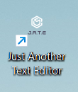

# Challenge 19: Progressive Note Taker with Auto Save

## Description
In Challenge 11, the task was to create a notetaking application that allowed the user to create new notes, save them, and delete them once they were no longer needed. However, one limitation was that it did not function offline, and the user should still be able to take notes even without an internet connection. This app, Just Another Text Editor (JATE), works online and offline, auto saves when the user clicks off of the text window, and can be installed on the user's computer. This project taught me how to use webpack to build an application, make an app installable, and modify the contents of a database.

## Table of Contents
- [Description](#description)
- [Installation](#installation)
- [Usage](#usage)
- [Credits](#credits)
- [Contributing](#contributing)
- [Tests](#tests)
- [License](#license)
- [Questions](#questions)

## Installation
No installation is required for this project; however, you can click the `Install!` button in the top left corner to install the app on your computer:

## Usage
When JATE is first opened, the text window shows the JATE logo:

After you write your own text, the new content is saved when you click anywhere besides the text window:

**Important:** You **must** click off of the text window to save the content. If you write new text then refresh or close the app without clicking off of the window first, your newest changes will be lost. However, clicking off of the window will save your changes with or without wifi.

JATE can also be installed from the browser. Clicking the install button opens an install prompt and produces a message in the console:

`You have clicked the install button.`

**Note:** the install button works both online and offline.

Installing JATE closes it in the browser and opens it in the app, producing the console message:

`The app has been installed successfully.`

It also creates an icon on your desktop:

After you install the app, you have the option to uninstall it. Click on the vertical ellipsis at the top of the app `⋮` to open a drop-down menu:

Clicking on `Uninstall Just Another Text Editor...` opens this prompt:

Clicking `Remove` with the check box next to `Also clear data from Chrome (http://localhost:3000)` filled out will remove your notes and delete the jate database from IndexedDB.

The following images show the Application tab of Chrome DevTools: 

**Manifest (1 of 3):**

**Manifest (2 of 3):**

**Manifest (3 of 3):**

**Service workers:**

**IndexedDB data:**

**Important:** The IndexedDB data does not automatically update when new changes are made. The following image shows a new line, `More pasta please :)`, being added:

which causes the warning message `⚠ Data may be stale` to appear in the top right corner. To see the updated text in the Value section, click the refresh icon `⭮` in the top left corner.

The deployed application can be found [here](https://progressive-note-taking-app-eb6bc28e4725.herokuapp.com/).

## Credits
Received assistance from tutor Mansi Patel, AskBCS assistant David, and TA Michael Seaman. Also received assistance in the *#02-ask-the-class* Slack channel from instructor Robbert Wijtman. The following web resources helped me write the code for this project:

1. [GitHub: The template option](https://github.com/jantimon/html-webpack-plugin/blob/main/docs/template-option.md)
2. [Request: destination property](https://developer.mozilla.org/en-US/docs/Web/API/Request/destination)
3. [Optional chaining](https://developer.mozilla.org/en-US/docs/Web/JavaScript/Reference/Operators/Optional_chaining)
4. [Code to make an app installable](https://web.dev/codelab-make-installable/)
5. [The toggle() method](https://developer.mozilla.org/en-US/docs/Web/API/DOMTokenList/toggle)

## Contributing
No contribution is necessary for this project.

## Tests
No tests have been written for this application.

## License
No license is attached to this repository.

## Questions
If you have any questions for me, you can [follow me on GitHub](https://github.com/GimmeKitties711) or email me at eric20wang.wang@gmail.com.
