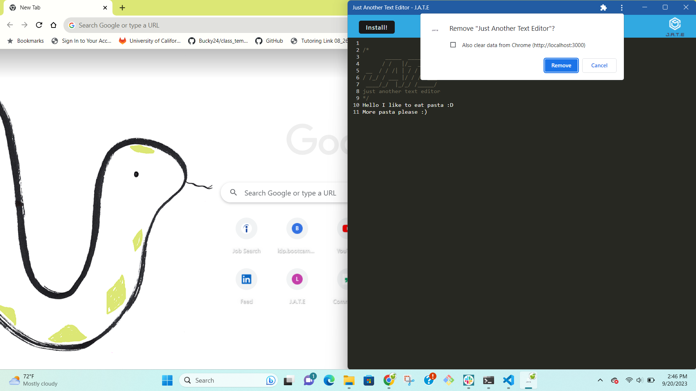

# Challenge 19: Progressive Note Taker with Auto Save

## Description
In Challenge 11, the task was to create a notetaking application where the user could create new notes, save them, and delete them once they were no longer needed. However, one limitation of this application was that it did not function offline. The user should still be able to take notes even without an internet connection. This application works offline, auto saves every time the user clicks off of the text window, and can be installed on the user's computer. I learned how to use webpack to build an application, make an app installable, and modify the contents of a database.

## Table of Contents
- [Description](#description)
- [Installation](#installation)
- [Usage](#usage)
- [Credits](#credits)
- [Contributing](#contributing)
- [Tests](#tests)
- [License](#license)
- [Questions](#questions)

## Installation
No installation is required for this project; however, you can click the 'Install!' button in the top left corner to install the app on your computer:

## Usage
The text editor starts with no text except the JATE (Just Another Text Editor) logo when loaded up:

After writing your own text, the new content is saved when you click off the window (anywhere outside of the writing area) 

**Important:** You **must** click off of the window to save the content. If you write new text then refresh or close the tab without clicking off the window first, your newest changes will be lost (browser only). You can also turn off the wifi and your changes are still saved.

JATE can also be installed from the browser. Clicking the install button produces a message in the console and opens a prompt:

`You have clicked the install button.`

**Note:** the install button works both online and offline.

Installing the app closes JATE in the browser and opens it in the app, producing the console message:

`The app has been installed successfully.`

After you install the app, you have the option to uninstall it. Click on the vertical stack of three dots at the top of the app to open a drop-down menu:

Once you click on `Uninstall Just Another Text Editor...`, you are asked to respond to this prompt:

The following images show the Application tab of Chrome DevTools: 

**Manifest (1 of 3):**

**Manifest (2 of 3):**

**Manifest (3 of 3):**

**Service workers:**

**IndexedDB data:**

**Important:** The IndexedDB data in the Application tab does not automatically update when new changes are made. The following image shows a new line, `More pasta please :)`, being added:

To see the updated text in the Value section, click the refresh icon ⭮ in the top left corner.

A link to the deployed application can be found [here](https://progressive-note-taking-app-eb6bc28e4725.herokuapp.com/).

## Credits
Received assistance from tutor Mansi Patel, AskBCS assistant David, TA Michael Seaman, and instructor Robbert Wijtman. The following web resources helped me write the code for this project:

[GitHub: The template option](https://github.com/jantimon/html-webpack-plugin/blob/main/docs/template-option.md)

[request: destination](https://developer.mozilla.org/en-US/docs/Web/API/Request/destination)

[Optional chaining](https://developer.mozilla.org/en-US/docs/Web/JavaScript/Reference/Operators/Optional_chaining)

[Code to make an app installable](https://web.dev/codelab-make-installable/)

[toggle() method](https://developer.mozilla.org/en-US/docs/Web/API/DOMTokenList/toggle)

## Contributing
No contribution is necessary for this project.

## Tests
No tests have been written for this application.

## License
No license is attached to this repository.

## Questions
If you have any questions for me, you can [follow me on GitHub](https://github.com/GimmeKitties711) or email me at eric20wang.wang@gmail.com.
